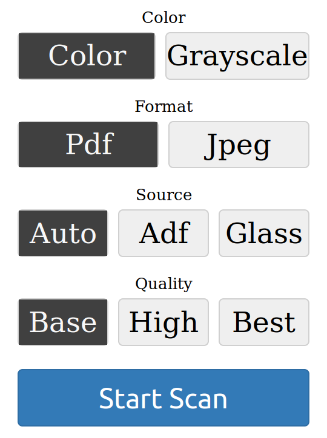

covet
=====

[](https://travis-ci.org/arminha/covet)
[](https://deps.rs/repo/github/arminha/covet)
[](https://crates.io/crates/covet)

A CLI and web frontend for scanning with HP Envy printer / scanners.

Features
--------

*   Supports HP Envy scanners
*   Scan documents from the command line or in a web UI
*   covet communicates with the scanner through a REST interface implemented in HP Envy scanners

Usage
-----

### Web UI

To start the web UI run
```
covet web <SCANNER>
```
where `<SCANNER>` is the hostname or IP address of your scanner. Then open [`http://127.0.0.1:3000/`](http://127.0.0.1:3000/) in your browser. It will show the following page with a simple form to scan a document.



#### Options

```
$ covet web -h

covet-web
Start a web server to handle scan jobs

USAGE:
    covet web [FLAGS] [OPTIONS] <SCANNER>

FLAGS:
    -h, --help      Prints help information
        --no-tls    Do not use TLS to secure the connection to the scanner

OPTIONS:
    -l, --listen <ADDR>    Listen address to use for the web server [default: 127.0.0.1]
    -p, --port <PORT>      Port to use for the web server [default: 3000]

ARGS:
    <SCANNER>    The hostname of the scanner
```

### Command line scanning

To scan a document directly from the command line run
```
$ covet scan <SCANNER>
```
where `<SCANNER>` is the hostname or IP address of your scanner. This will scan a document and store it as a PDF in the current directory.

#### Options

```
$ covet scan -h`

covet-scan
Scan a document

USAGE:
    covet scan [FLAGS] [OPTIONS] <SCANNER>

FLAGS:
    -h, --help      Prints help information
        --no-tls    Do not use TLS to secure the connection to the scanner

OPTIONS:
    -c, --color <COLORSPACE>               The color space of the output [default: color]  [possible values: gray,
                                           color]
    -f, --format <FORMAT>                  The format of the output [default: pdf]  [possible values: pdf, jpeg]
    -q, --compression-quality <QUALITY>    Compression quality level (lower is better) [default: 25]
    -r, --resolution <RESOLUTION>          The scan resolution in dpi [default: 300]  [possible values: 300, 600]
    -s, --source <SOURCE>                  The document source [default: auto]  [possible values: auto, adf, glass]

ARGS:
    <SCANNER>    The hostname of the scanner
```
